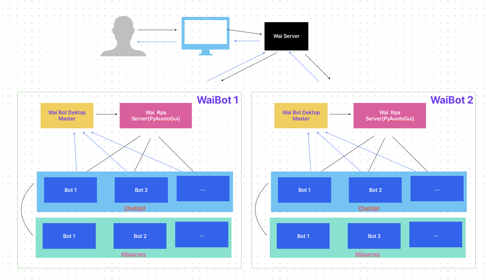

# WaiBot Desktop

A Robot Automation Program Built with Rust
一款基于Rust的机器人自动化程序

## Core Components

- **Wai Bot Desktop Master Control**: This component is the management and scheduling master program developed using the Rust language and Tauri framework. It focuses on the retrieval, allocation, aggregation, and reporting of tasks.
- **Wai RPA (PyAutoGui)**: This module is responsible for handling automation processes such as simulating mouse clicks and typing text.
- **ChatGpt Bot (GPT Chatbot)** / **Midjourney Bot (AI Drawing Tool)**: These robots are dedicated to executing specific tasks.
- **Integration**: ChatGpt Bot and Midjourney Bot are integrated through the Wai Bot Desktop Master Control, facilitating collaborative work.

## 核心组件

- **Wai Bot桌面主控**: 此部分为使用Rust语言和Tauri框架开发的管理及调度主程序。它专注于任务的获取、分派、汇总和上报。
- **Wai RPA (PyAutoGui)**: 此模块负责处理自动化过程，例如模拟鼠标点击和键入文本。
- **ChatGpt Bot（GPT对话机器人**）/ **Midjourney Bot（AI绘图工具）**: 这些机器人专责执行具体任务。
- **集成**: ChatGpt Bot和Midjourney Bot通过Wai Bot桌面主控进行集成，实现协同工作。

## * Wai Bot Desktop Master Control

### - INSTALL

    sudo npm install -g pnpm
    pnpm install

### - Run Dev

    # 编译 Wai RPA
    npm run build_rpa
    npm start 

### - Run Build Local

    # 编译 Wai RPA
    npm run build_rpa
    npm run build

###  - 发布

- Github `Settings` > `Actions` > `General` > `Workflow permissions` > `Workflows have read and write permissions in the repository for all scopes.`

- change `package.json` > `version` to `0.0.1`
- change `src-tauri/tauri.conf.json` > `package.version` to `0.0.1`

    export VERSION=0.0.1
    node tools/wai-change-release-version.js

###  - Updater

- Github `Settings` > `Pages` > add `gh-pages` branch

    npm run tauri signer generate -- -w ~/.tauri/wai-bot-desktop.key
    #输入密码, 假设 为: TAURI_KEY_PASSWORD
    
- 复制 `.tauri/wai-bot-desktop.key.pub` 的内容 到 `src-tauri/tauri.conf.json` > `updater.pubkey`
- 在 github 项目后台 `Settings` > `Secrets and variables` > `Actions` > `Secrets`

增加

- TAURI_KEY_PASSWORD 
- TAURI_PRIVATE_KEY `.tauri/wai-bot-desktop.pub`

## * Wai RPA (PyAutoGui)

### Requirements:

    pip install pynput
    pip install pyautogui
    pip install pyinstaller

### Step 1: Debug the screen position

    python py/wai-click-position.py

### Step 2: Starting  the Server Of Dev

    python py/wai-rpa.py

### Step 3: Sending POST Request with curl

You can use curl to send a POST request to the server. Save the below JSON payload in a file named `py/demo/payload-demo.json`

    {
        "steps": [
            {
                "cmd": "moveTo",
                "x": 100,
                "y": 200
            },
            {
                "cmd": "click"
            },
            {
                "cmd": "typewrite",
                "text": "Hello, World!"
            },
            {
                "cmd": "hotkey",
                "keys": ["ctrl", "shift", "n"]
            },
            {
                "cmd": "press",
                "key": "f1"
            },
            {
                "cmd": "sleep",
                "sec": 2
            }
        ]
    }

Now use curl to send this JSON payload to your server:

    curl -X POST -H "Content-Type: application/json" --data @py/demo/payload-demo.json http://localhost:8688

    
# Thanks to

- [lencx/ChatGPT](https://github.com/lencx/ChatGPT)

# License

- [GNU-v3.0 License](https://github.com/ptp-build/wai-bot-desktop/blob/main/LICENSE)
